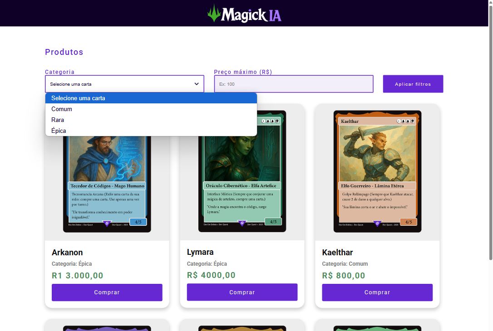

# Catálogo de Produtos - busca por filtros

  

Este é um projeto simples de catálogo de produtos, construído com HTML, CSS e JavaScript. A ideia principal é permitir que os usuários visualizem uma lista de "cartas" (produtos) e apliquem filtros de categoria e preço máximo para refinar a busca.  
Este projeto foi desenvolvido durante a Semana do Zero ao Programador do Dev em Dobro.

## 🚀 Tecnologias Utilizadas
O projeto foi construído utilizando as seguintes tecnologias web:
- **HTML**: Para a estrutura e conteúdo da página.
- **CSS**: Para o estilo e layout visual.
- **JavaScript**: Para a interatividade e funcionalidade de filtragem.

## ✨ Funcionalidades JavaScript
A principal funcionalidade deste projeto é a capacidade de filtrar as cartas exibidas com base em critérios de categoria e preço máximo através do JavaScript.
### Detalhes das Funcionalidades JavaScript:
- **Seleção de Categoria**: O JavaScript captura a categoria selecionada pelo usuário no dropdown (`<select id="categoria">`).
- **Definição de Preço Máximo**: Ele também lê o valor numérico inserido pelo usuário no campo de input de preço (`<input id="preco">`).
- **Aplicação Dinâmica dos Filtros**: Ao clicar no botão "Aplicar filtros", o JavaScript itera sobre cada "carta". Para cada carta, ele verifica:
  - Se a categoria da carta corresponde à categoria selecionada (caso uma categoria tenha sido escolhida).
  - Se o preço da carta é menor ou igual ao preço máximo inserido (caso um preço máximo tenha sido definido).
- **Exibição e Ocultação**: Com base nas condições dos filtros, o JavaScript adiciona ou remove as classes "mostrar" e "esconder" das cartas, controlando sua visibilidade na tela. Isso permite que apenas as cartas que atendem aos critérios dos filtros sejam exibidas.
